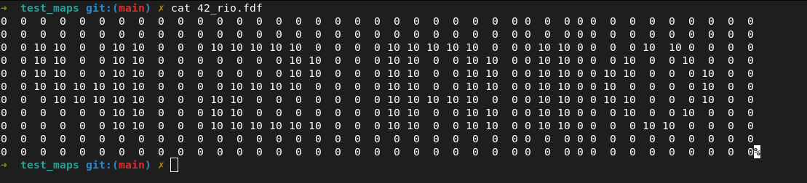
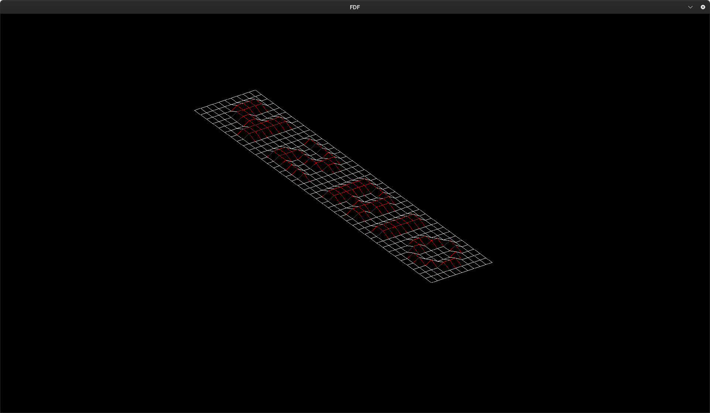
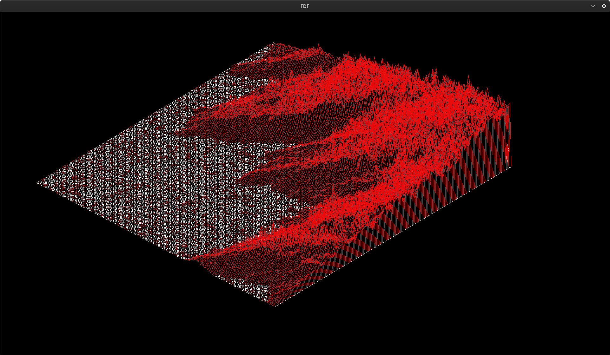
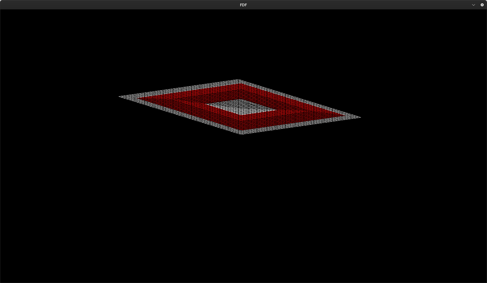
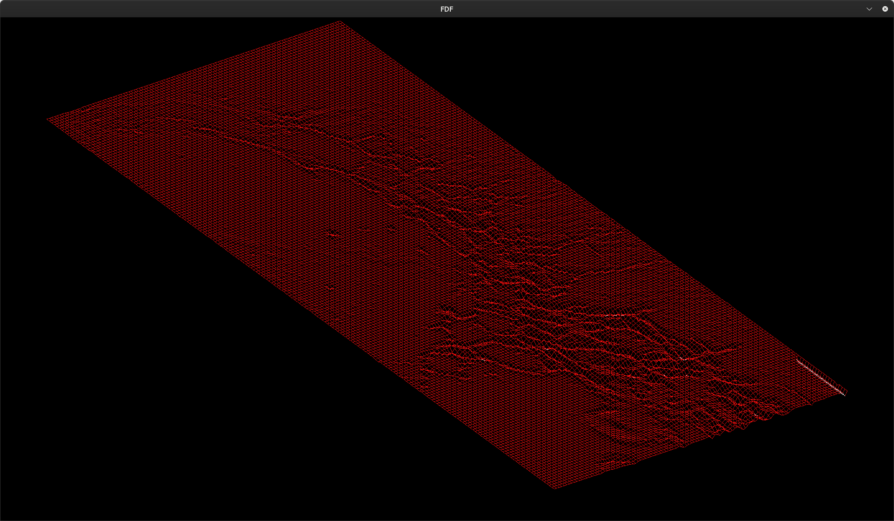

# FDF

<p align="center">
  <a href="">
    
  </a>
</p>

# Table of Contents
- [Table of Contents](#table-of-contents)
- [0. Description](#0-description)
- [1. Requirements](#1-requirements)
- [2. How to execute the program](#2-How-to-execute-the-program)
- [3. Graphic Management](#3-graphic-management)
- [4. Running Makefile](#4-running-makefile)

# 0. Description 

This project is about creating a simple wireframe 3D landscape by linking various points(x, y, z) thanks to line segments(edges). 

# 1. Requirements

• You must use the MiniLibx. 

• You have to turn in a Makefile which will compile your source files. It must not relink.

• You program has to represent the model in **isometric projection**. The coordinate of the landscape are stored in a **.fdf** file passed as a parameter to your program.

<p align="center">
  <a href="">
    
  </a>
</p>

• The horizontal position corresponds to its axis.

• The vertical position corresponds to its ordinate.

• The value corresponds to its altitude

• Your program mustn’t have memory leaks.


# 2. How to execute the program


```sh
# Samples of commands
$> ./fdf maps/test_maps/42_rio.fdf 
```
<p align="center">
  <a href="">
    
  </a>
</p>

# 3. Graphic Management

• Teclado

ESC -> close the window;

ARROWS -> translate the map;

(**+** / **-** )  -> Zoom in and out

(**a** / **w** / **d** / **s**) -> rotate the map;

(**p**) -> parallel projection
(**i**) -> isometric projection

(**b**) -> dimetric projection


# 4. Running Makefile

```sh
# will download the minilibx 
$> make minilibx 

# Will generate a executable
$> make all

# Execute valgrind. Will check memory leaks
$> make leak

# will run norminette 
$> make norma

```

# 5. Maps

<p align="center">
  <a href="">
    
  </a>
</p>

<p align="center">
  <a href="">
    
  </a>
</p>

<p align="center">
  <a href="">
    
  </a>
</p>